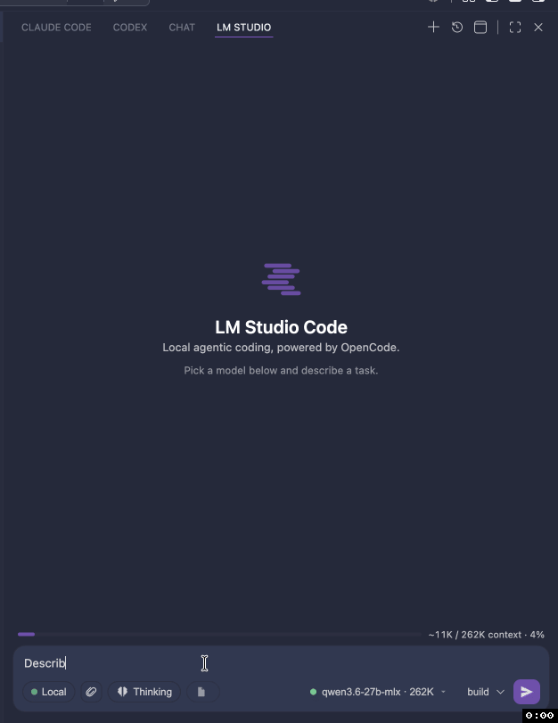

# LM Studio Code

An agentic coding panel for **your local [LM Studio](https://lmstudio.ai) models** — a Claude Code / Codex–style chat experience that runs entirely on your machine.

Under the hood it drives the open-source [**OpenCode**](https://opencode.ai) agent (Apache/MIT) as a headless server, pointed at LM Studio's OpenAI-compatible endpoint. You get a real agent — file edits, shell tools, permissions, multi-step reasoning — with no cloud model and no API key.

## Demo



## Why

The official Claude Code and Codex VS Code extensions are **not open source**, so they can't be adapted to local models. The *CLIs* behind several agents are open, though — and OpenCode in particular ships a headless server + provider-agnostic model layer that happily talks to LM Studio. This extension wraps that server in a native chat panel.

## Features

- **Chat panel** in the Activity Bar (and "Open in Editor Tab" for parallel conversations)
- **Streaming** responses with markdown + code rendering
- **Reasoning** blocks (collapsible "Thinking")
- **Agent tools** — file reads/edits, shell, search — surfaced as tool cards
- **MCP servers** — extend the agent with [Model Context Protocol](https://modelcontextprotocol.io) tools; servers you already configured for **Claude Code** (`.mcp.json`) or **VS Code** (`.vscode/mcp.json`) are picked up automatically
- **Permission prompts** — Allow once / Allow always / Deny, inline
- **Model picker** populated live from LM Studio (shows loaded ● / unloaded ○ + context size)
- **Agent modes** — `build` (can edit) and `plan` (read-only)
- **Session history** — browse, resume, rename-by-first-message, delete
- **Auto-context** — reloads the selected model with an adequate context window via the `lms` CLI so OpenCode's large system prompt doesn't overflow a 4096-token default

## Requirements

- **VS Code** 1.104+
- **[LM Studio](https://lmstudio.ai)** running with its local server started (default `http://127.0.0.1:1234`) and at least one chat model
- *(recommended)* the **`lms` CLI** for automatic context-window management

> **[OpenCode](https://opencode.ai) is bundled** — the matching platform binary ships inside the extension, so there's nothing extra to install and it works offline. Power users can point at their own build with `lmstudioCode.opencodePath`; an install on your `PATH` or in `~/.opencode/bin` is preferred over the bundled copy if present.

## Quick start

1. Start LM Studio's server and load a model.
2. Install this extension (or run it from source — see below).
3. Click the spark icon in the Activity Bar.
4. Pick a model, type a task, hit Enter.

## Settings

| Setting | Default | Description |
| --- | --- | --- |
| `lmstudioCode.lmStudioBaseUrl` | `http://127.0.0.1:1234/v1` | LM Studio OpenAI-compatible base URL |
| `lmstudioCode.opencodePath` | _(bundled)_ | Override path to an `opencode` binary; empty uses your own install (PATH / `~/.opencode`) or the bundled one |
| `lmstudioCode.serverPort` | `0` | Embedded server port (0 = auto) |
| `lmstudioCode.defaultModel` | _(first)_ | Default model id |
| `lmstudioCode.agent` | `build` | `build` or `plan` |
| `lmstudioCode.autoEnsureContext` | `true` | Reload model with adequate context before prompting |
| `lmstudioCode.minContextLength` | `16384` | Context length to (re)load with |
| `lmstudioCode.gpuOffload` | `max` | GPU offload for `lms load` |
| `lmstudioCode.mcpServers` | `{}` | MCP servers to expose to the agent (in addition to auto-discovered ones) |

## MCP servers

The agent can call tools from [MCP (Model Context Protocol)](https://modelcontextprotocol.io) servers — browser automation, databases, issue trackers, docs, etc. OpenCode runs the servers; this extension just gathers them and hands them over.

**Servers are discovered from (low → high precedence):**

1. `.mcp.json` at your workspace root — the **Claude Code** project format (`{ "mcpServers": { … } }`)
2. `.vscode/mcp.json` — the **VS Code** workspace format (`{ "servers": { … } }`)
3. VS Code's user-level `mcp` setting
4. `lmstudioCode.mcpServers` — this extension's own setting (wins on a name collision)

So if you already use MCP with Claude Code or VS Code Copilot, those servers work here with **nothing to re-enter**. To add one just for LM Studio Code, set `lmstudioCode.mcpServers`:

```jsonc
"lmstudioCode.mcpServers": {
  // local (stdio) server
  "playwright": { "command": "npx", "args": ["-y", "@playwright/mcp@latest"] },
  // remote (http/sse) server, with a token pulled from the environment
  "docs": {
    "type": "http",
    "url": "https://example.com/mcp",
    "headers": { "Authorization": "Bearer ${MY_TOKEN}" }
  }
}
```

`${VAR}` references are resolved from the environment before the server launches. Set `"enabled": false` to keep a server defined but off. Changes to this setting (or VS Code's `mcp` setting) restart the agent automatically; edits to the `.mcp.json` / `.vscode/mcp.json` files apply on the next **LM Studio Code: Restart OpenCode Server** (or window reload).

> **Mind the context window.** Each MCP server adds its tool schemas to every request. Local models have far less context than cloud ones (OpenCode's own system prompt + built-in tools already use ~11k tokens), so enable only the servers you need and raise `lmstudioCode.minContextLength` if tools start crowding out the conversation.
>
> **`npx`/`uvx` on PATH.** Local servers launched with `npx`/`uvx` need Node/those tools on `PATH`. The extension augments `PATH` with common install locations (Homebrew, `~/.local/bin`, etc.), but if a server fails to start, check **LM Studio Code: Show Logs**.

## How it works

```
VS Code webview (chat UI)
        │  postMessage
        ▼
Extension host (bridge)
        │  HTTP + SSE  (raw fetch)
        ▼
opencode serve   ──OpenAI /v1──▶  LM Studio (local model)
   (headless, config injected via OPENCODE_CONFIG_CONTENT)
```

The LM Studio provider is injected into OpenCode at launch via the
`OPENCODE_CONFIG_CONTENT` environment variable — **nothing is written to your
workspace or global config.** Discovered LM Studio models are declared in the
provider's `models` map (OpenCode requires this for custom OpenAI-compatible
providers).

## Develop from source

```bash
npm install
npm run bundle:opencode      # fetch the pinned OpenCode binary into bin/ for your platform
npm run compile              # type-check + bundle (extension + webview)
# then press F5 in VS Code to launch the Extension Development Host
npm run package:vsix:bundled # build a platform .vsix with the binary embedded
```

The OpenCode binary is fetched at build time (pinned by `opencodeVersion` in
`package.json`) and is never committed — `bin/` is git-ignored. Bump that field
to upgrade the bundled OpenCode. F5 also resolves the binary from `bin/`, so run
`bundle:opencode` once before launching the dev host.

## License

MIT
